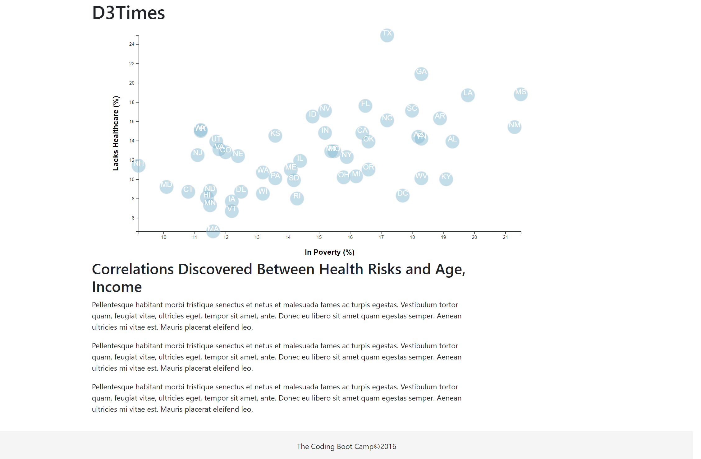

# d3-challenge

The purpose of the visualization depicted below is to understand the health risks facing particular demographics after reviewing information from the U.S. Census Bureau and the Behavioral Risk Factor Surveillance System.  Specifically, the data set is based on the 2014 ACS 1-year estimates, which includes data on rates of income, obseity, poverty, etc. by state: https://factfinder.census.gov/faces/nav/jsf/pages/searchresults.xhtml

